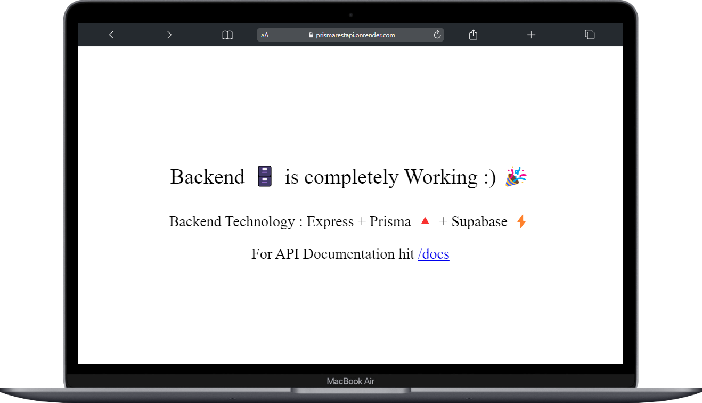

### REST API With Prisma + Supabase

``` This Project is  For Learning Perpopse only. ```

### Live Link ---->>> [Live Link](https://prismarestapi.onrender.com/)

This api is learning purpose only and it 's tech stack is below
### Node + Express
### Prisma
### Supabse(Postgresql)
### Docker(containerization)

### Below is screenshot

### Api Base url with sucess 🎉



### Api with data


### Database (Table) Diagram


### Docker Image url --->>> [prisma_supabase_restapi](https://hub.docker.com/repositories/kashyap14112003)


## Contributing

If you want to contribute to the development of DrinkDost, please fork the repository and submit a pull request.

---

